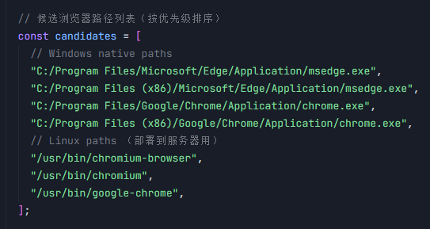
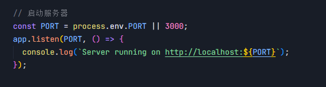

# Warframe Status API Server

**概述**

- 提供 Warframe 国际服与国服（WeGame）状态数据的统一 API。
- 控制层内置缓存模块：`src/controllers/deCache.js` 与 `src/controllers/wgCache.js`。
- 缓存会定时刷新与保存到本地 JSON 文件，并在控制台输出区分“原始/处理后”缓存的保存信息。

**快速开始**

- 安装依赖：
  - `npm install`
- 启动服务：
  - `node server.js`
- 默认地址：
  - `http://localhost:3000/`

**路由**

- 开始统一双服数据结构
- 根路由 `GET /`：返回当前可用的子路由列表
- 国际服（`/de`）：
  - `GET /de/all` 国际服原始数据
  - `GET /de/all/process` 国际服处理后的聚合数据
  - `GET /de/alerts` 警报
  - `GET /de/plain/cycles` 平原循环
  - `GET /de/invasions` 入侵
  - `GET /de/archsortie` 执行官周常
  - `GET /de/shipprogress` 船只建造进度
  - `GET /de/sortie` 每日突击
  - `GET /de/stellrewad` 钢铁之路每周奖励（含常驻）
  - `GET /de/fissures` 虚空裂隙
- 国服（`/wg`）：
  - `GET /wg/all`国服原始数据,
  - `GET /wg/all/process` 国服处理过的聚合数据,
  - `GET /wg/alerts` 警报,
  - `GET /wg/cycle` 平原循环,
  - `GET /wg/invasions` 入侵,
  - `GET /wg/sortie` 每日突击,
  - `GET /wg/fissures` 虚空裂隙,
  - `GET /wg/plainJobs` 平原赏金,
  - `GET /wg/voidTrader` 虚空商人,
  - `GET /wg/deltav` 达尔特惠,
  - `GET /wg/events` 事件,
  - `GET /wg/constructionProgress` 建造进度,
  - `GET /wg/steelRewad` 钢铁之路每周奖励（含常驻）,
  - `GET /wg/archSortie` 执行官周常,

**缓存机制**

- 国际服缓存模块：`src/controllers/deCache.js`
  - 刷新间隔：`60s`
  - 保存间隔：`60s`
  - 保存目录：`src/cache`
  - 文件命名：
    - 原始：`decache-<timestamp>.json`
    - 处理后：`decache-processed-<timestamp>.json`
  - 控制台输出：
    - `[deCache]已删除旧缓存文件: ...`
    - `[deCache]缓存已保存(原始): <path>`
    - `[deCache]缓存已保存(处理过的): <path>`
- 国服缓存模块：`src/controllers/wgCache.js`
  - 刷新间隔：`60s`
  - 保存间隔：`60s`
  - 保存目录：`src/cache/wg`
  - 文件命名：
    - 原始：`wgcache-<timestamp>.json`
    - 处理后：`wgcache-processed-<timestamp>.json`
  - 控制台输出：
    - `[wgCache]已删除旧缓存文件: ...`
    - `[wgCache]缓存已保存(原始): <path>`
    - `[wgCache]缓存已保存(处理过的): <path>`

**国际化资源**

- `<lang>`: 目前仅支持中文（zh）国际服
- 配置：`src/configs/i8nPaths.js`
- 资源：`src/public/i18n/<lang>/...`
  - 中文：`src/public/i18n/zh/*`
    - 示例：`solNodes.json`、`missionTypes.json`、`fissureLevel.json`、`sortieData.json`、`itemsData.json`、`factionData.json`
  - 国服：`src/public/i18n/CH/*`
    - 示例：`solNodes.json`

**国服数据抓取（WeGame）**

- 模块：`src/utils/getWg.js`
- 依赖：`puppeteer-core`（不自带浏览器）

  - 可替换为 Puppeteer 或其他浏览器控制库

- 如果报错，优先检查浏览器路径是否指定正确。
  

**依赖**

- `express`
- `axios`
- `puppeteer-core` 可替换 puppteer

**启动日志示例**

- `Server running on http://localhost:3000`
- port 可在 `server.js` 中修改
  
- 缓存保存时会输出已删除旧文件与新文件路径（区分“原始/处理过的”，“国际服/国服”）。
